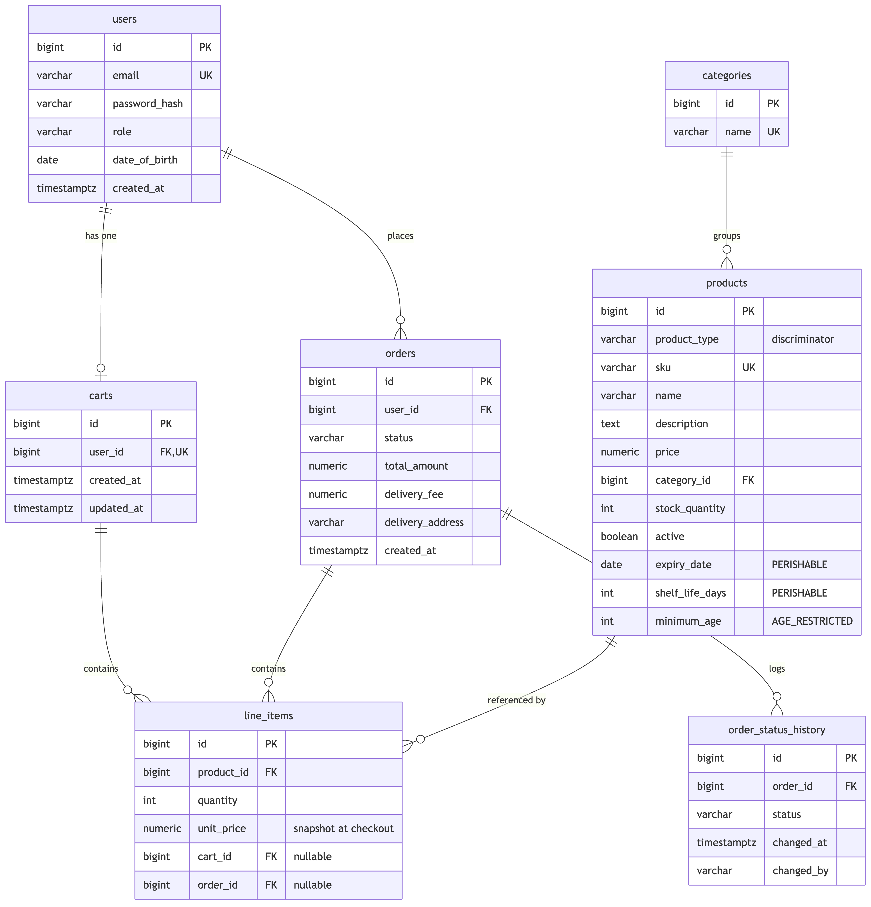
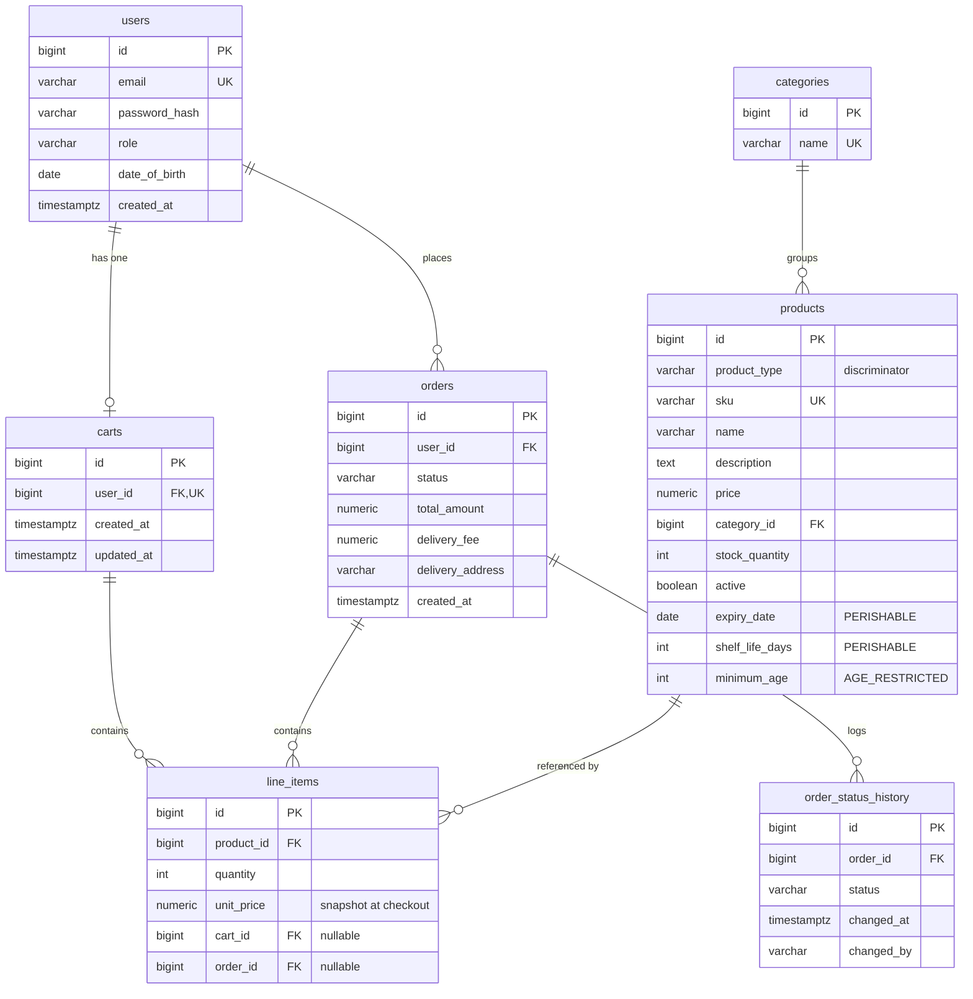
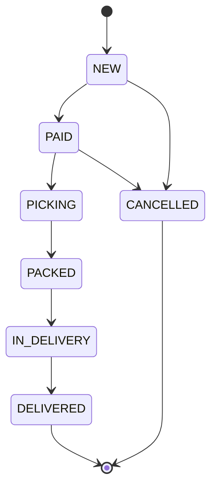

# Entity–Relationship Diagram

The schema is owned by Flyway (`src/main/resources/db/migration`). Products use
`SINGLE_TABLE` inheritance: all subtypes share the `products` table, discriminated by
`product_type`, with subtype‑specific nullable columns.

Mermaid source

## Order lifecycle (State pattern)

