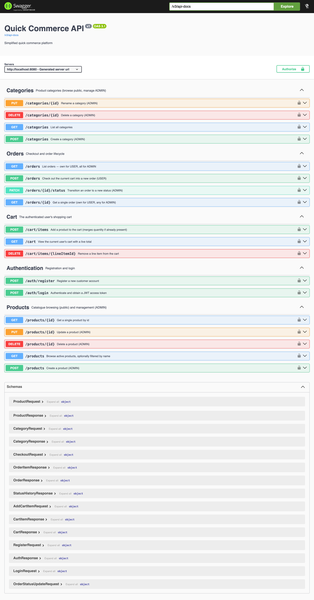
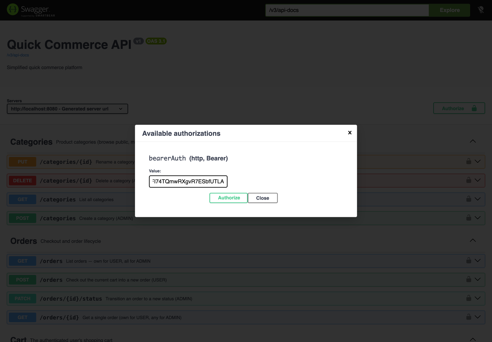
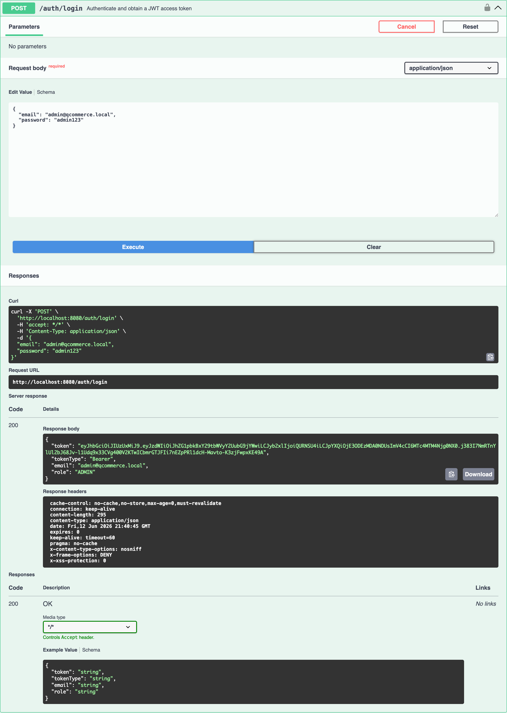
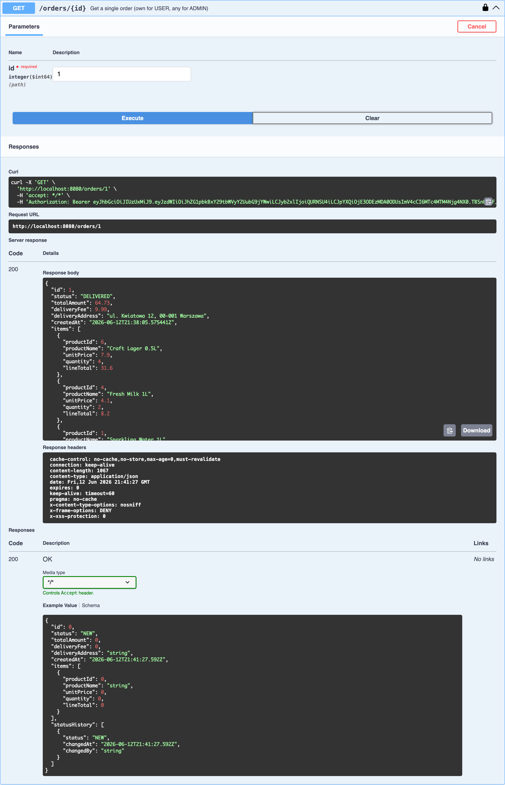

# Swagger UI screenshots

Captured from the running application at `http://localhost:8080/swagger-ui.html`
(seeded with sample categories, products, a customer and a delivered order).

## Endpoint overview

The full API grouped by tag (Authentication, Products, Categories, Cart, Orders) plus schemas.

## Authorize dialog

Pasting a Bearer JWT into the **Authorize** dialog (`bearerAuth`, HTTP Bearer).

## `POST /auth/login` response

A successful login returning the JWT, token type and role.

## `GET /orders/{id}` response

An order showing `status`, line items with frozen `unitPrice`, and the full `statusHistory`.

---

To re-capture: start the app, run the seed flow, then drive Swagger UI with a headless
Chromium/Edge browser. A machine-readable snapshot of the API is committed at
[`../openapi.json`](../openapi.json).
